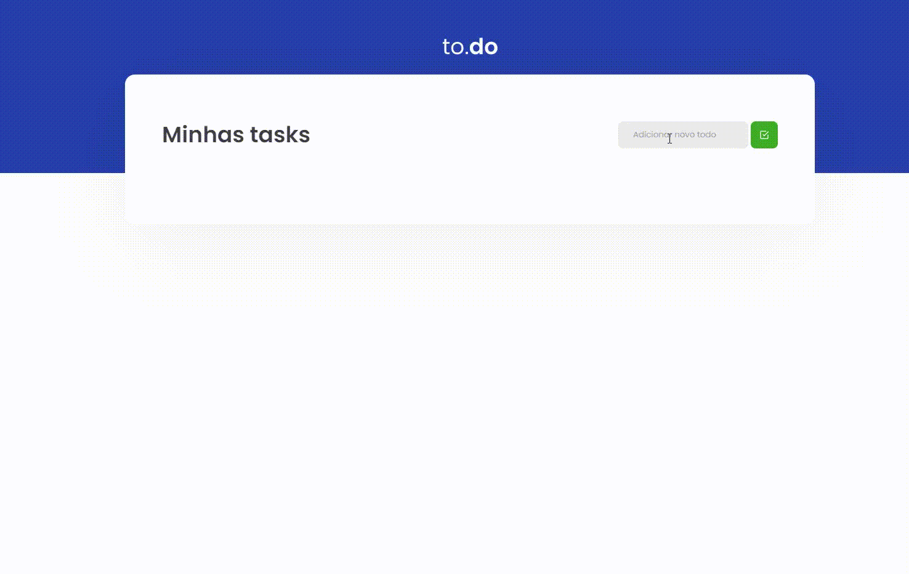

## Preview



## Sobre esse projeto

Este é o primeiro desafio da trilha de react proposto pela RocketSeat

***Ele é obrigatório aos alunos que estão participando do bootcamp***

## Qual é o objetivo

Apartir de uma template, completar a criação de uma aplicação ***TO.DO***, respeitando todos os testes que serão executados via jest.

Os testes são: 

- **should be able to add a task**

Para que esse teste passe, deve ser possível que a task seja criada e com isso, exibida em tela.

- **should not be able to add a task with an empty title**

Para que esse teste passe, antes de criar uma nova task, você deve validar se algo foi digitado no input e não permitir a criação da task caso o valor seja vazio, caso o valor digitado seja vazio, você deve impedir a criação da task.

- **should be able to remove a task**

Para que esse teste passe, você deve permitir que ao clicar no botão com ícone de uma lixeira, a task relacionada a esse botão seja removida do estado da aplicação, consequentemente sendo removida da tela.

- **should be able to check a task**

Para que esse teste passe, deve ser possível que ao clicar no checkbox ao lado da task, ela seja marcada como concluída ou não concluída de acordo com seu estado atual, alterando seu valor de `isComplete` de `false` para `true` ou ao contrário, de `true` para `false`.

## Instalação

Caso tenha ficado interessado em ver o funcionamento, basta seguir esses passos:

```
$ git clone https://github.com/LucasMSCaetano/Desafio01-TrilhaReact-RocketSeat.git

$ cd Desafio01-TrilhaReact-RocketSeat
```

**Instale as dependências**

```
$ yarn
```

_ou_

```
$ npm install
```

**Agora basta executar o comando**

```
$ yarn dev
```

Caso tenha ficado alguma duvida ou esteja interessada em bater um papo sobre react me chame em uma das redes sociais abaixo vou adorar trocar essa ideia! ✌😜

<a href = "mailto:lucas.matheu.caetano@gmail.com"></a>
<a href="https://www.linkedin.com/in/lucas-matheus-a95774186/" target="_blank"></a> 
<a href="https://www.instagram.com/lucaxmatheux/" target="_blank"></a>
